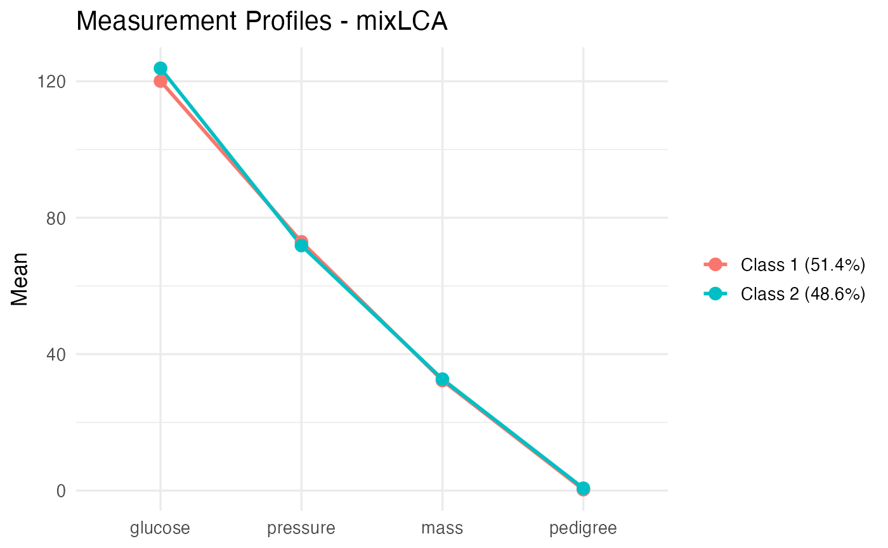

# Concomitant Predictors and Distal Outcomes

## The partitioned architecture

`mixLCA` enforces a temporal separation between three blocks of
variables:

1.  **Antecedent concomitant predictors**: variables that come *before*
    class formation and shift the probability of belonging to each
    latent class (e.g., demographics).
2.  **Contemporaneous manifest indicators**: variables that *define* the
    classes (the measurement model).
3.  **Subsequent distal outcomes**: variables that are *consequences* of
    class membership and should not contaminate it.

Mixing these blocks naively produces double-counted information. Letting
a distal outcome help define classes mechanically inflates its
predictive power; letting a concomitant predictor enter the measurement
model leaks its variance into class meaning. `mixLCA` keeps the three
blocks separate: concomitants enter through a multinomial logistic
regression on class membership, and distals are estimated *after* the
measurement model has converged, under Bollen-Curran-Heckman (BCH)
inverse-classification-error weighting.

This vignette walks through both pieces on the Pima Indians Diabetes
dataset, a small, well-known mixed dataset with continuous health
indicators, an age covariate, and a binary diabetes outcome.

## Setup

``` r
data("PimaIndiansDiabetes2", package = "mlbench")
pima_vars <- c("glucose", "pressure", "mass", "pedigree")
pima <- PimaIndiansDiabetes2[stats::complete.cases(
  PimaIndiansDiabetes2[, c(pima_vars, "age", "diabetes")]), ]
dim(pima)
head(pima[, c(pima_vars, "age", "diabetes")])
```

A few hundred complete cases remain after listwise deletion on the four
indicators plus `age` and `diabetes`.

## 1. A naive measurement model (no covariates, no distal)

``` r
pima_naive <- lapply(2:3, function(K) {
  fit_lca(pima, continuous = pima_vars, n_classes = K,
          control = lca_control(n_starts = 10, seed = 110),
          verbose = FALSE)
})
names(pima_naive) <- paste0("K", 2:3)
```

``` r
compare_models(pima_naive)
#>    K        LL n_params      AIC      BIC     aBIC   entropy      ICL
#> K2 2 -8778.273       29 17614.55 17747.50 17655.42 0.5391194 18210.08
#> K3 3 -8708.250       44 17504.50 17706.23 17566.52 0.5783434 18377.00
```

The K=2 model has the lowest BIC and the cleanest interpretation (a
“metabolically healthier” vs. “less healthy” split). We work with it
below.

``` r
plot(pima_naive$K2, type = "profiles")
```



Class-mean profiles, naive K=2.

## 2. Adding a concomitant predictor

The age of the respondent is plausibly antecedent to her metabolic class
(the data come from women 21+). We let class membership depend on age
via multinomial logistic regression.

### Character-vector form

The simplest specification passes a character vector of variable names:

``` r
pima_concom_chr <- fit_lca(
  pima, continuous = pima_vars, concomitant = "age",
  n_classes = 2,
  control = lca_control(n_starts = 10, seed = 110),
  verbose = FALSE)
```

``` r
pima_concom_chr$concomitant_coefs
#>                    [,1]
#> (Intercept) -2.60449147
#> age          0.07736749
```

Each column gives the log-odds (relative to class 1) for the
corresponding non-reference class. Here the coefficient on `age` is
positive, meaning older respondents are more likely to fall in class 2,
consistent with metabolic markers worsening with age.

For inference, pair the coefficients with their standard errors:

``` r
se <- concomitant_se(pima_concom_chr, pima)
data.frame(
  Estimate = round(pima_concom_chr$concomitant_coefs[, 1], 4),
  SE       = round(se[, 1], 4)
)
#>             Estimate     SE
#> (Intercept)  -2.6045 0.3873
#> age           0.0774 0.0120
```

### Formula form

If you want interactions, polynomials, transformations, or factor
dummy-coding, supply a one-sided formula instead. `fit_lca` constructs
the design matrix via
[`stats::model.matrix`](https://rdrr.io/r/stats/model.matrix.html), so
anything that works in [`lm()`](https://rdrr.io/r/stats/lm.html) works
here:

``` r
pima_concom_fm <- fit_lca(
  pima, continuous = pima_vars, concomitant = ~ age + I(age^2),
  n_classes = 2,
  control = lca_control(n_starts = 10, seed = 110),
  verbose = FALSE)
```

``` r
pima_concom_fm$concomitant_coefs
#>                     [,1]
#> (Intercept) -4.658603553
#> age          0.200477683
#> I(age^2)    -0.001704627
```

The quadratic captures whether the age effect saturates. With a single
positive linear term and a small negative quadratic, the model says
class-2 membership rises with age, but the marginal effect declines
above a certain age.

Other useful forms:

``` r
# Interaction:
fit_lca(..., concomitant = ~ age * sex)

# Polynomial of degree 3:
fit_lca(..., concomitant = ~ poly(age, 3))

# Spline (requires splines pkg loaded):
fit_lca(..., concomitant = ~ splines::bs(age, df = 4))
```

### NAs in concomitant predictors

[`fit_lca()`](https://asanaei.github.io/mixLCA/reference/fit_lca.md)
will refuse to run if any concomitant value is NA. This is by design:
silently dropping rows would desynchronise `model$posteriors` from your
input data and would invalidate any downstream distal model that expects
per-row alignment. Impute or filter before calling:

``` r
pima_na <- pima
pima_na$age[1:3] <- NA
fit_lca(pima_na, continuous = pima_vars, concomitant = "age",
        n_classes = 2)
#> Error: Missing values detected in concomitant predictors.
#> Impute or filter these rows before calling fit_lca() ...
```

## 3. Out-of-sample prediction

[`predict()`](https://rdrr.io/r/stats/predict.html) returns class
posteriors for new data using the fitted parameters. Three output types:

``` r
new_rows <- pima[1:5, ]
prob <- predict(pima_concom_chr, newdata = new_rows)          # default: matrix
cls  <- predict(pima_concom_chr, newdata = new_rows, type = "class")
all  <- predict(pima_concom_chr, newdata = new_rows, type = "all")

list(prob = prob, cls = cls, all = all)
#> $prob
#>         P_class_1  P_class_2
#> [1,] 2.069642e-02 0.97930358
#> [2,] 9.622888e-01 0.03771119
#> [3,] 4.835310e-04 0.99951647
#> [4,] 9.821090e-01 0.01789096
#> [5,] 1.906067e-31 1.00000000
#> 
#> $cls
#> [1] 2 1 2 1 2
#> 
#> $all
#>      P_class_1  P_class_2 modal_class max_posterior   log_lik
#> 1 2.069642e-02 0.97930358           2     0.9793036 -10.95667
#> 2 9.622888e-01 0.03771119           1     0.9622888 -10.35501
#> 3 4.835310e-04 0.99951647           2     0.9995165 -14.07066
#> 4 9.821090e-01 0.01789096           1     0.9821090 -10.44063
#> 5 1.906067e-31 1.00000000           2     1.0000000 -24.21890
```

If `newdata` has NAs in concomitant columns, the corresponding output
rows are padded with NA so the output length always equals
`nrow(newdata)`:

``` r
new_with_na <- pima[1:5, ]
new_with_na$age[c(2, 4)] <- NA
predict(pima_concom_chr, newdata = new_with_na)
#>         P_class_1 P_class_2
#> [1,] 2.069642e-02 0.9793036
#> [2,]           NA        NA
#> [3,] 4.835310e-04 0.9995165
#> [4,]           NA        NA
#> [5,] 1.906067e-31 1.0000000
```

Rows 2 and 4 are NA, which makes `cbind(new_with_na, predict(...))`
unambiguous.

## 4. Distal outcome estimation

The diabetes status is a *consequence* of metabolic class. We do **not**
put it in the measurement model; we estimate it separately under BCH
weighting.

The BCH method (Bolck, Croon, Hagenaars 2004; refined by Vermunt 2010)
constructs class-specific inverse-classification-error weights from the
fitted posteriors, then fits a class-specific regression on the distal
outcome using those weights. Because the measurement model is frozen
before the distal step, no gradient from the distal outcome can
contaminate class meaning.

``` r
pima_distal <- distal(pima_concom_chr, pima,
                      formula = diabetes ~ age,
                      family  = "binomial")
```

``` r
print(pima_distal)
#> 
#> Distal Outcome Estimation (BCH Method) - mixLCA
#> ================================================
#> Formula: diabetes ~ age 
#> Family : binomial 
#> Classes: 2 
#> 
#> --- Class 1 ---
#>             Estimate       SE      z     p
#> (Intercept) -1.39513  2.54052 -0.549 0.583
#> age         -0.02859  0.10220 -0.280 0.780
#>   Effective N: 373.5 
#> 
#> --- Class 2 ---
#>             Estimate       SE      z      p  
#> (Intercept)  0.85883  0.47377  1.813 0.0699 .
#> age         -0.01126  0.01066 -1.056 0.2908  
#> ---
#> Signif. codes:  0 '***' 0.001 '**' 0.01 '*' 0.05 '.' 0.1 ' ' 1
#>   Effective N: 350.5 
#> 
#> Classification Error Matrix:
#>        [,1]  [,2]
#> [1,] 0.9171 0.164
#> [2,] 0.0829 0.836
```

Reading the output: class 1 (the metabolically healthier class) has a
negative diabetes intercept (low baseline risk); class 2 has a positive
intercept (higher baseline risk). The `age` slope within each class is
small. Class membership already absorbs most of the age signal.

The **classification error matrix** at the bottom tells you how
confident the modal assignment is. Diagonal dominance close to 1 means
the BCH adjustment is mild; values closer to 0.5 mean classification is
uncertain and the BCH weights are pulling more strongly.

### Other families

[`distal()`](https://asanaei.github.io/mixLCA/reference/distal.md)
supports gaussian, binomial, and poisson responses through the `family`
argument:

``` r
# Continuous distal outcome:
distal(pima_concom_chr, pima, outcome ~ age, family = "gaussian")

# Count distal outcome:
distal(pima_concom_chr, pima, n_events ~ age, family = "poisson")
```

The IRLS solver inside
[`distal()`](https://asanaei.github.io/mixLCA/reference/distal.md)
handles negative BCH weights via eigen-projection plus step-halving (a
real divergence risk before mixLCA 1.0.1) and reports `NA` standard
errors when the sandwich estimator goes negative (rather than the
misleading $p \approx 0$ you get from forcing the variance to zero).

## 5. Penalized covariance (when local dependence is continuous)

For continuous indicators with local dependence, switching from `"full"`
to `"penalized"` covariance with `glassoFast` produces exact sparsity in
the inverse covariance matrix.

``` r
pima_pen <- fit_lca(
  pima, continuous = pima_vars, concomitant = "age",
  n_classes = 2, dependence = "penalized",
  control = lca_control(n_starts = 10, seed = 110),
  verbose = FALSE)
```

The default `penalty = "auto"` selects a heuristic value from data
scale. To request exactly no shrinkage, set `penalty = 0` explicitly.

``` r
round(pima_pen$continuous_params$covariances[[1]], 4)
#>           [,1]     [,2]    [,3]   [,4]
#> [1,] 1005.7911 -12.1869 18.6876 0.0000
#> [2,]  -12.1869 128.8711 16.1328 0.0000
#> [3,]   18.6876  16.1328 51.9639 0.0000
#> [4,]    0.0000   0.0000  0.0000 3.8543
```

## 6. Putting it together

A typical analysis arc:

``` r
# 1. Decide K with a naive fit
fits <- lapply(2:5, function(K)
  fit_lca(pima, continuous = pima_vars, n_classes = K,
          control = lca_control(n_starts = 10, seed = 110)))
compare_models(fits)

# 2. Add concomitants
fit <- fit_lca(pima, continuous = pima_vars,
               concomitant = ~ age,
               n_classes = 2,
               control = lca_control(n_starts = 10, seed = 110))

# 3. Diagnose local dependence
bvr_tests(fit, pima)

# 4. Estimate distal under BCH
distal(fit, pima, diabetes ~ age, family = "binomial")
```

See
[`vignette("workflow")`](https://asanaei.github.io/mixLCA/articles/workflow.md)
for the categorical local-dependence side of the picture (BVR direct
effects and SLD), and
[`vignette("sld-theory")`](https://asanaei.github.io/mixLCA/articles/sld-theory.md)
for the math.

## Session info

``` r
sessionInfo()
#> R version 4.4.3 (2025-02-28)
#> Platform: aarch64-apple-darwin20
#> Running under: macOS Sequoia 15.7.4
#> 
#> Matrix products: default
#> BLAS:   /Library/Frameworks/R.framework/Versions/4.4-arm64/Resources/lib/libRblas.0.dylib 
#> LAPACK: /Library/Frameworks/R.framework/Versions/4.4-arm64/Resources/lib/libRlapack.dylib;  LAPACK version 3.12.0
#> 
#> locale:
#> [1] C
#> 
#> time zone: America/Chicago
#> tzcode source: internal
#> 
#> attached base packages:
#> [1] stats     graphics  grDevices utils     datasets  methods   base     
#> 
#> other attached packages:
#> [1] mixLCA_1.0.1
#> 
#> loaded via a namespace (and not attached):
#>  [1] gtable_0.3.6       jsonlite_2.0.0     dplyr_1.2.0        compiler_4.4.3    
#>  [5] tidyselect_1.2.1   Rcpp_1.1.0         jquerylib_0.1.4    systemfonts_1.2.3 
#>  [9] scales_1.4.0       textshaping_1.0.1  yaml_2.3.10        fastmap_1.2.0     
#> [13] ggplot2_4.0.2      R6_2.6.1           labeling_0.4.3     generics_0.1.4    
#> [17] knitr_1.51         htmlwidgets_1.6.4  tibble_3.3.0       desc_1.4.3        
#> [21] bslib_0.9.0        pillar_1.11.0      RColorBrewer_1.1-3 rlang_1.1.7       
#> [25] cachem_1.1.0       xfun_0.52          fs_1.6.7           sass_0.4.10       
#> [29] S7_0.2.1           cli_3.6.5          pkgdown_2.2.0      withr_3.0.2       
#> [33] magrittr_2.0.3     digest_0.6.37      grid_4.4.3         lifecycle_1.0.5   
#> [37] vctrs_0.7.1        evaluate_1.0.4     glue_1.8.0         farver_2.1.2      
#> [41] ragg_1.4.0         rmarkdown_2.30     tools_4.4.3        pkgconfig_2.0.3   
#> [45] htmltools_0.5.8.1
```
