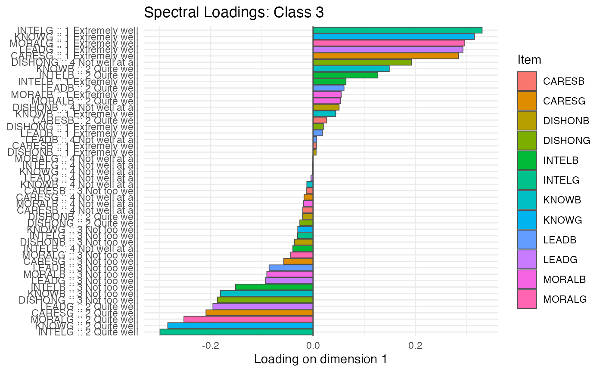
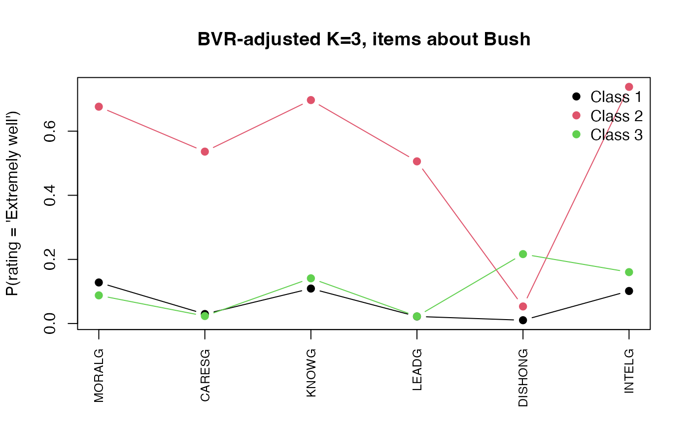

# A Workflow for Latent Class Analysis: Naive Fit, BVR Adjustments, and Spectral Local Dependence

## Why this vignette

Latent class models are easy to over-trust. The default specification
assumes the manifest indicators are *locally independent* within each
class. That is, conditional on class membership the items carry no
further information about each other. When that assumption is violated,
the EM algorithm compensates by inventing extra classes whose only
purpose is to absorb pairwise correlation. The resulting solution
inflates $K$, distorts class meaning, and inflates the standard errors
of any downstream distal analysis.

This vignette walks through three responses to that problem on a single
dataset:

1.  A **naive fit** that treats local independence as given.
2.  A **BVR-guided fit** that adds pairwise direct effects between
    manifest items whose bivariate residuals (Vermunt, 1999) exceed a
    chi-squared threshold.
3.  A fit with **Spectral Local Dependence (SLD)**, a low-rank
    decomposition of the conditional Burt matrix that captures
    correlated structure across *many* items at once (see the companion
    vignette
    [`vignette("sld-theory")`](https://asanaei.github.io/mixLCA/articles/sld-theory.md)
    for the math).

We use [`poLCA::election`](https://rdrr.io/pkg/poLCA/man/election.html),
a study of how respondents rated the moral character, competence, and
dishonesty of George W. Bush (`G` items) and Al Gore (`B` items) in
2000. The items come in conceptually parallel pairs (`MORALG`/`MORALB`,
`KNOWG`/`KNOWB`, and so on), so we have an *a priori* reason to expect
local dependence: ratings of the same candidate cluster together, and
parallel items about the two candidates may also covary through partisan
affect.

## Setup

``` r
data("election", package = "poLCA")
cat_items <- c("MORALG", "CARESG", "KNOWG",  "LEADG",  "DISHONG", "INTELG",
               "MORALB", "CARESB", "KNOWB",  "LEADB",  "DISHONB", "INTELB")

# `fit_lca` requires a complete-case rectangle in the indicators (it
# tolerates NAs in the categorical likelihood, but auto_bvr's
# bookkeeping is cleaner without them).
keep <- stats::complete.cases(election[, cat_items])
elec <- election[keep, ]
dim(elec)
```

Each item is rated on a four-point scale. The respondent count after
listwise deletion is about 1,311.

## 1. The naive fit: ignore local dependence

We fit two-, three-, and four-class models with `dependence = "full"` on
the (nonexistent) continuous side and *implicit* local independence on
the categorical side.

``` r
elec_fits <- lapply(2:4, function(K) {
  fit_lca(elec, categorical = cat_items, n_classes = K,
          control = lca_control(n_starts = 5, seed = 110),
          verbose = FALSE)
})
names(elec_fits) <- paste0("K", 2:4)
```

``` r
compare_models(elec_fits)
#>    K        LL n_params      AIC      BIC     aBIC   entropy      ICL
#> K2 2 -17344.92       73 34835.85 35213.88 34981.99 0.8099402 35559.30
#> K3 3 -16714.66      110 33649.32 34218.96 33869.54 0.8335060 34698.56
#> K4 4 -16350.59      147 32995.19 33756.44 33289.49 0.8509381 34298.26
```

The standard reading: BIC keeps dropping as we add classes, suggesting
$K \geq 4$. Entropy is in the comfortable range. Most analysts would
declare success here.

That conclusion is fragile.

## 2. Diagnosing local dependence with bivariate residuals

[`bvr_categorical()`](https://asanaei.github.io/mixLCA/reference/bvr_categorical.md)
computes a chi-squared statistic for each pair of items, contrasting the
observed bivariate frequency against what the model predicts under local
independence. Values above 3.84 indicate significant local dependence
($p < .05$, ${df} = 1$).

``` r
fit_K3 <- elec_fits$K3
bvr_K3 <- bvr_categorical(fit_K3, elec)
head(bvr_K3, 8)
#>      var1    var2      bvr df       p_value
#> 24  KNOWG  INTELG 519.7075  9 3.457269e-106
#> 63  KNOWB  INTELB 374.6492  9  3.487782e-75
#> 13 CARESG   LEADG 289.8999  9  3.615664e-57
#> 1  MORALG  CARESG 237.1667  9  5.084504e-46
#> 4  MORALG DISHONG 196.7695  9  1.574751e-37
#> 22  KNOWG   LEADG 177.7468  9  1.496528e-33
#> 3  MORALG   LEADG 177.1786  9  1.966309e-33
#> 32  LEADG  INTELG 176.2117  9  3.128787e-33
```

Several pairs sit far above the threshold, and the structure is not
random. The largest residuals fall along the candidate diagonal
(`G`-items pair with `G`-items, `B`-items pair with `B`-items). The
model is forcing parallel ratings of the same candidate to look
conditionally independent when they manifestly are not.

We can also visualise the residual network on the continuous side via
`plot(model, type = "bvr")`; the same diagnostic logic applies to
categorical pairs once you tabulate them.

## 3. BVR-guided specification search

[`auto_bvr()`](https://asanaei.github.io/mixLCA/reference/auto_bvr.md)
automates the Hagenaars-Vermunt-Magidson specification search: at each
step it identifies the largest BVR pair, adds it as a direct effect,
refits, and stops when BIC ceases to improve (or a cap is hit).

``` r
elec_bvr <- auto_bvr(
  data = elec, categorical = cat_items,
  K_range = 3,                 # fix K so the comparison stays clean
  max_direct_effects = 4L,
  bvr_threshold = 3.84,
  seed = 110, verbose = FALSE,
  n_starts = 5)

elec_bvr$auto_path$direct_effects
```

The search added three direct effects:

``` r
elec_bvr$auto_path$direct_effects
#> [[1]]
#> [1] "KNOWG"  "INTELG"
#> 
#> [[2]]
#> [1] "KNOWB"  "INTELB"
#> 
#> [[3]]
#> [1] "KNOWB" "LEADB"
```

All three involve the `KNOW` items, which is interpretable: judgements
about how much a candidate “knows” cluster with judgements about
competence (`INTELG`, `LEADB`) on the *same* candidate. The BVR
machinery surfaced what was already visible in the residual table.

``` r
fi_naive <- fit_indices(fit_K3)
fi_bvr   <- fit_indices(elec_bvr)

data.frame(
  Model      = c("Naive K=3", "BVR-adjusted K=3"),
  log_lik    = round(c(fi_naive$log_lik, fi_bvr$log_lik), 2),
  n_params   = c(fi_naive$n_params,     fi_bvr$n_params),
  BIC        = round(c(fi_naive$BIC,    fi_bvr$BIC), 2),
  entropy    = round(c(fi_naive$entropy, fi_bvr$entropy), 3)
)
#>              Model   log_lik n_params      BIC entropy
#> 1        Naive K=3 -16714.66      110 34218.96   0.834
#> 2 BVR-adjusted K=3 -15957.32      191 33285.75   0.819
```

BIC drops sharply (~ 33 points per direct effect on this dataset, far in
excess of the BIC penalty for the extra parameters). The specification
is straightforwardly better, and it does so without inflating $K$.

## 4. Spectral Local Dependence (SLD)

Direct effects work pair by pair. When the dependence is
*low-dimensional* (for example, an underlying latent direction such as
partisanship that pulls many ratings of the same candidate together),
SLD captures the same structure in a single rank-$d$ projection instead
of $d \cdot K$ separate pairwise terms.

[`auto_sld()`](https://asanaei.github.io/mixLCA/reference/auto_sld.md)
runs a greedy forward search over class-specific ranks, adding one rank
to the class with the largest unmodelled eigenvalue, accepting only if
BIC improves.

``` r
elec_sld <- auto_sld(
  data = elec, categorical = cat_items,
  n_classes = 3,
  max_rank_per_class = 3L,
  criterion = "BIC",
  seed = 110, verbose = FALSE)
elec_sld$specs$spectral_rank
```

``` r
elec_sld$specs$spectral_rank
#> [1] 1 0 2
round(fit_indices(elec_sld)$BIC, 2)
#> [1] 33762.96
```

`auto_sld` settles at ranks `[1, 0, 2]`: class 2 (the
moderate/ambivalent class) gets no spectral structure, while the two
more polarized classes each pick up at least one low-rank latent
direction. The BIC drops from ~34219 (naive K=3) to ~33763, a real gain,
though smaller than the BVR-adjusted fit (~33286).

This comparison is informative on its own:

``` r
fi_naive <- fit_indices(fit_K3)
fi_bvr   <- fit_indices(elec_bvr)
fi_sld   <- fit_indices(elec_sld)

data.frame(
  Model    = c("Naive K=3", "BVR (3 direct effects)", "SLD (ranks 1,0,2)"),
  n_params = c(fi_naive$n_params, fi_bvr$n_params, fi_sld$n_params),
  BIC      = round(c(fi_naive$BIC, fi_bvr$BIC, fi_sld$BIC), 2),
  entropy  = round(c(fi_naive$entropy, fi_bvr$entropy, fi_sld$entropy), 3)
)
#>                    Model n_params      BIC entropy
#> 1              Naive K=3      110 34218.96   0.834
#> 2 BVR (3 direct effects)      191 33285.75   0.819
#> 3      SLD (ranks 1,0,2)      213 33762.96   0.819
```

On this dataset, **pairwise direct effects win**. The election items
divide cleanly into G-pairs and B-pairs, so the local dependence shows
up as a small number of large pairwise residuals, exactly what direct
effects were designed to absorb. SLD captures the same structure but
spends parameters on every item-pair coupling that the latent direction
implies, even pairs that the data does not flag as dependent.

**SLD shines elsewhere**: when residual covariance is *broadly*
distributed across many items (say, a partisanship dimension that shifts
every rating slightly), the rank-$d$ projection beats
$\left( \frac{J}{2} \right)$ candidate direct-effect terms. See
[`vignette("sld-theory")`](https://asanaei.github.io/mixLCA/articles/sld-theory.md)
for the math and a worked example.

You can also inspect the SLD loadings to read off which items contribute
to each latent direction:

``` r
plot(elec_sld, type = "spectral_loadings", dimension = 1, class = 3)
```



SLD loadings: rank 1 in class 3.

## 5. Substantive comparison: who are the classes?

``` r
props_naive <- round(colMeans(get_posteriors(fit_K3)), 3)
props_bvr   <- round(colMeans(get_posteriors(elec_bvr)), 3)
data.frame(class = 1:3, naive = props_naive, bvr_adjusted = props_bvr)
#>   class naive bvr_adjusted
#> 1     1 0.419        0.419
#> 2     2 0.320        0.260
#> 3     3 0.261        0.321
```

The class proportions move only slightly. The substantive class meaning
changes more visibly in the response profiles:

``` r
# Build a small profile plot manually from the categorical params.
# This keeps the vignette dependency-light and shows readers exactly
# how to extract any quantity from a fitted mixLCA object.
extract_extremely_well <- function(fit, items) {
  K <- fit$n_classes
  cp <- fit$categorical_params
  out <- matrix(NA_real_, K, length(items), dimnames = list(paste("Class", 1:K), items))
  for (k in 1:K) {
    for (it in items) {
      probs <- cp[[k]][[it]]
      hit   <- grep("Extremely well", names(probs), ignore.case = TRUE, fixed = FALSE)
      if (length(hit)) out[k, it] <- probs[[hit[1]]]
    }
  }
  out
}

g_items <- c("MORALG","CARESG","KNOWG","LEADG","DISHONG","INTELG")
mat_naive <- extract_extremely_well(fit_K3, g_items)

matplot(t(mat_naive), type = "b", pch = 19, lty = 1,
        xaxt = "n", xlab = "", ylab = "P(rating = 'Extremely well')",
        main = "Naive K=3, items about Bush")
axis(1, at = seq_along(g_items), labels = g_items, las = 2, cex.axis = 0.8)
legend("topright", legend = rownames(mat_naive), pch = 19, col = 1:nrow(mat_naive), bty = "n")
```


Naive K=3: P(rating = ‘Extremely well’ \| class) for the six G-items.

The three classes separate as you would expect: one strongly positive
about Bush across all items, one negative, one ambivalent. The BVR-
adjusted model recovers the same broad story but with sharper edges
because direct effects relieve the latent classes from explaining the
within-candidate covariance:

``` r
mat_bvr <- extract_extremely_well(elec_bvr, g_items)
matplot(t(mat_bvr), type = "b", pch = 19, lty = 1,
        xaxt = "n", xlab = "", ylab = "P(rating = 'Extremely well')",
        main = "BVR-adjusted K=3, items about Bush")
axis(1, at = seq_along(g_items), labels = g_items, las = 2, cex.axis = 0.8)
legend("topright", legend = rownames(mat_bvr), pch = 19, col = 1:nrow(mat_bvr), bty = "n")
```



BVR-adjusted K=3: same items.

## 6. Takeaways

- **Run the diagnostic.** A satisfying BIC trajectory across $K$ is not
  evidence that your specification is correct. Always inspect
  [`bvr_categorical()`](https://asanaei.github.io/mixLCA/reference/bvr_categorical.md)
  (for categorical indicators) or
  [`bvr_tests()`](https://asanaei.github.io/mixLCA/reference/bvr_tests.md)
  (for continuous) before naming the classes.
- **Pairwise vs. low-rank.** Direct effects handle a few misbehaving
  pairs efficiently; SLD handles broad residual structure efficiently.
  The two are complementary;
  [`fit_lca()`](https://asanaei.github.io/mixLCA/reference/fit_lca.md)
  lets you supply both.
- **Don’t add classes to absorb dependence.** The naive K=4 fit looked
  like it was winning on BIC. Once we model the local dependence
  properly, K=3 is fine, and class meaning is preserved across refits.

See also:

- [`vignette("distal-covariates")`](https://asanaei.github.io/mixLCA/articles/distal-covariates.md)
  for distal outcome estimation under BCH weighting, and for the formula
  interface to concomitant predictors.
- [`vignette("sld-theory")`](https://asanaei.github.io/mixLCA/articles/sld-theory.md)
  for the math and a worked example where SLD outperforms BVR.

## Session info

``` r
sessionInfo()
#> R version 4.4.3 (2025-02-28)
#> Platform: aarch64-apple-darwin20
#> Running under: macOS Sequoia 15.7.4
#> 
#> Matrix products: default
#> BLAS:   /Library/Frameworks/R.framework/Versions/4.4-arm64/Resources/lib/libRblas.0.dylib 
#> LAPACK: /Library/Frameworks/R.framework/Versions/4.4-arm64/Resources/lib/libRlapack.dylib;  LAPACK version 3.12.0
#> 
#> locale:
#> [1] C
#> 
#> time zone: America/Chicago
#> tzcode source: internal
#> 
#> attached base packages:
#> [1] stats     graphics  grDevices utils     datasets  methods   base     
#> 
#> other attached packages:
#> [1] mixLCA_1.0.1
#> 
#> loaded via a namespace (and not attached):
#>  [1] gtable_0.3.6       jsonlite_2.0.0     dplyr_1.2.0        compiler_4.4.3    
#>  [5] tidyselect_1.2.1   Rcpp_1.1.0         jquerylib_0.1.4    systemfonts_1.2.3 
#>  [9] scales_1.4.0       textshaping_1.0.1  yaml_2.3.10        fastmap_1.2.0     
#> [13] ggplot2_4.0.2      R6_2.6.1           labeling_0.4.3     generics_0.1.4    
#> [17] knitr_1.51         htmlwidgets_1.6.4  tibble_3.3.0       desc_1.4.3        
#> [21] bslib_0.9.0        pillar_1.11.0      RColorBrewer_1.1-3 rlang_1.1.7       
#> [25] cachem_1.1.0       xfun_0.52          fs_1.6.7           sass_0.4.10       
#> [29] S7_0.2.1           cli_3.6.5          pkgdown_2.2.0      withr_3.0.2       
#> [33] magrittr_2.0.3     digest_0.6.37      grid_4.4.3         lifecycle_1.0.5   
#> [37] vctrs_0.7.1        evaluate_1.0.4     glue_1.8.0         farver_2.1.2      
#> [41] ragg_1.4.0         rmarkdown_2.30     tools_4.4.3        pkgconfig_2.0.3   
#> [45] htmltools_0.5.8.1
```
